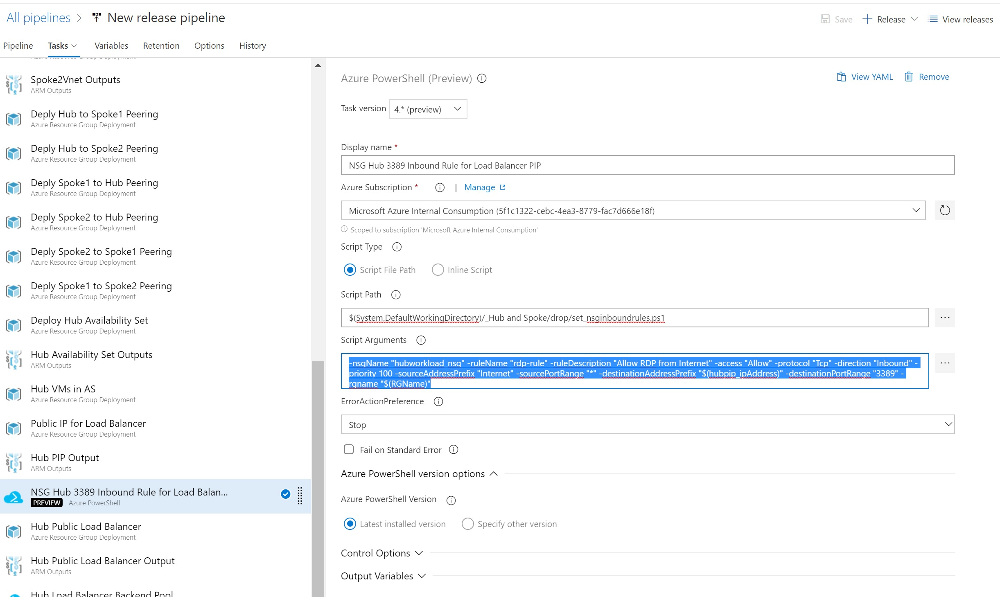

# Script: Network Security Group Inbound Rule
This script will ad an inbound rule to an already existing Network Security Group. 

This script is usually utilized after the below Template and utilizes the output:

> [NSG]("https://dev.azure.com/Security-Monitoring/_git/IaC_HubSpokeNetwork?path=%2FTier%201%2FNSG%2FTier1.NSG%2FTier1.NSG%2FREADME.md&version=GBmaster")  

The utilization of this script is reliant of a Network Security Group already existing.

## Required Inputs
In order to execute this script you must provide the following parameters.  

- nsgName: The name of the Network Security Group the inbound rule will be added to  
- ruleName: The display name of the inbound rule  
- ruleDescription: Description explaining the purpose of the rule  
- access: Set to either Allow or Deny  
- protocol: Can be set to TCP, UDP, or Both  
- direction: This can be set to either Inbound or Outbound  
- priority: Integer setting the priority of the rule  
- sourceAddressPrefix: Sets the source address range for the rule  
- sourcePortRange: Can be set to a single port or a range of ports  
- destinationAddressPrefix: Sets the destination address range for the rule  
- destinationPortRange: Can be set to a single port or a range of ports
- rgName: Resource Group name that the Network Security Group is located in

## Example Usage in Azure DevOps

1) Utilize the Azure PowerShell version 4.* (This will utilize the Az module)  

2) Choose the Azure subscription to deploy the task to

3) Choose "Script File Path"

4) Use the following path for the script:

	$(System.DefaultWorkingDirectory)/_Hub and Spoke/drop/set_nsginboundrules.ps1

5) Fill in the script parameters. Below is an example:

	-nsgName "hubworkload_nsg" -ruleName "rdp-rule" -ruleDescription "Allow RDP from Internet" -access "Allow" -protocol "Tcp" -direction "Inbound" -priority 100 -sourceAddressPrefix "Internet" -sourcePortRange "*" -destinationAddressPrefix "$(hubpip_ipAddress)" -destinationPortRange "3389" -rgname "$(RGName)"

