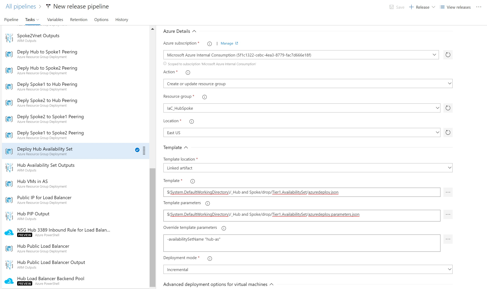

# Tier 1 Availability Set
This template deploys an Availability Set to a Resource Group in Azure.  

This template is usually deployed before and used in the below templates:

[VM in Availability Set](https://dev.azure.com/Security-Monitoring/_git/IaC_HubSpokeNetwork?path=%2FTier%202%2FVirtual%20Machines%2FTier2.VMinAvailabilitySet%2FREADME.md&version=GBmaster)

The deployment of this template is not dependent on any other templates.

## Required Inputs
In order to execute this template you must provide the following information.  

- availabilitySetName: Display Name for the availability set when created.  

## Outputs
This template will output the following information to be used by other templates.  
- asid: This is the Availability Set ResourceID
- name: This is the display name of the Availability Set

## Example Usage in Azure DevOps

1) Utilize the Azure Resource Group Deployment Task  

2) Choose the Azure subscription to deploy the task to

3) The "Action" should be "Create or update resource group"

4) Fill in the information for the "Resource group" and "Location"

5) Point to the template file located 

	$(System.DefaultWorkingDirectory)/_Hub and Spoke/drop/Tier1.AvailabilitySet/azuredeploy.json

6) Point to the parameter file located

	$(System.DefaultWorkingDirectory)/_Hub and Spoke/drop/Tier1.AvailabilitySet/azuredeploy.parameters.json

7) Override the availabilitySetName property with the name you want for the availability set

