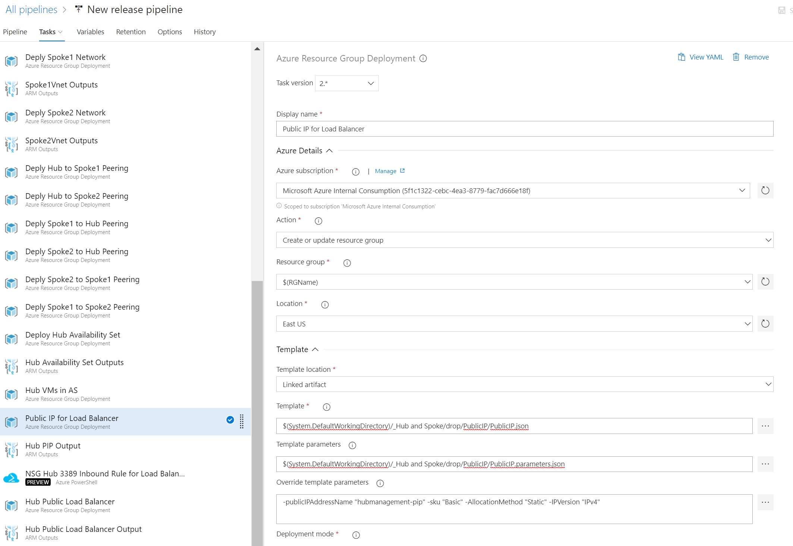

# Tier 1 Public IP Address
This template deploys a Public IP to a Resource Group in Azure.  

This template is usually deployed before and used in the below templates:

[Public Load Balancer]("https://dev.azure.com/Security-Monitoring/_git/IaC_HubSpokeNetwork?path=%2FTier%202%2FLoad%20Balancers%2FPublic%20Load%20Balancer%2FPublic%20Load%20Balancer%2FREADME.md&version=GBmaster")

The deployment of this template is not dependent on any other templates.

## Required Inputs
In order to execute this template you must provide the following information.  

- publicIPAddressName: Display Name for the Public IP Address  
- sku: Allowed values are Basic or Standard  
- AllocationMethod: Allowed values are Static or Dynamic  
- IPVersion: Allowed values are IPv4 or IPv6  

## Outputs
This template will output the following information to be used by other templates.  
- PIPResourceID: This is the Resource ID for the Public IP Address  
- ipAddress: This is the IP Address that was assigned to the Public IP Address resource

## Example Usage in Azure DevOps

1) Utilize the Azure Resource Group Deployment Task  

2) Choose the Azure subscription to deploy the task to

3) The "Action" should be "Create or update resource group"

4) Fill in the information for the "Resource group" and "Location"

5) Point to the template file located 

	$(System.DefaultWorkingDirectory)/_Hub and Spoke/drop/PublicIP/PublicIP.json

6) Point to the parameter file located

	$(System.DefaultWorkingDirectory)/_Hub and Spoke/drop/PublicIP/PublicIP.parameters.json

7) Override the Public IP Address properties with the appropriate values

