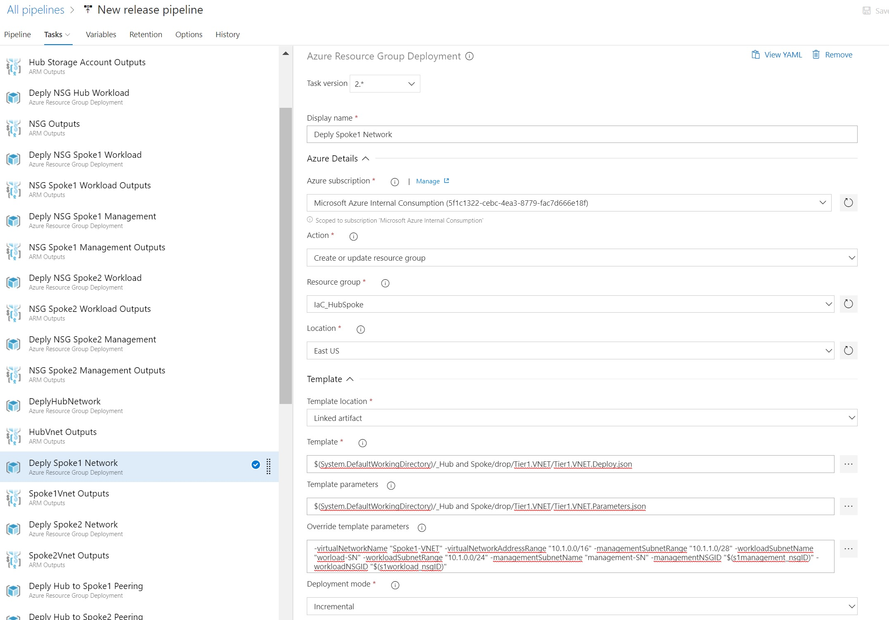

# Tier 1 Hub Virtual Network Deployment

This template deploys a Virtual Network to a Resource Group in Azure. The Virtual Network will have the following features: 
 
> A Management Subnet to hold your management resources.  
> A Workload Subnet to contain any resources you need to place in this Virtual Network  

This template is usually deployed before and used by the following templates:    
	[VNET Peering]("https://dev.azure.com/Security-Monitoring/_git/IaC_HubSpokeNetwork?path=%2FTier%201%2FVNets%2FTier1.VNETPeering%2FREADME.md&version=GBmaster")  
	[VMs in Availability Set]("https://dev.azure.com/Security-Monitoring/_git/IaC_HubSpokeNetwork?path=%2FTier%202%2FVirtual%20Machines%2FTier2.VMinAvailabilitySet%2FREADME.md&version=GBmaster")  
	[Standalone VMs](https://dev.azure.com/Security-Monitoring/_git/IaC_HubSpokeNetwork?path=%2FTier%202%2FVirtual%20Machines%2FTier2.VMsStandalone%2FTier2.VMsStandalone%2FREADME.md&version=GBmaster)  

The deployment of this template is dependent on the following templates:  
	[Network Security Group]("https://dev.azure.com/Security-Monitoring/_git/IaC_HubSpokeNetwork?path=%2FTier%201%2FNSG%2FTier1.NSG%2FTier1.NSG%2FREADME.md&version=GBmaster") 

## Required Inputs
In order to execute this template you must provide the following information.  

- virtualNetworkName: This is the name that will be given to the Virtual Network  
- virtualNetworkAddressRange: This is the address range in CIDR format for the Virtual Network (Example: 10.0.0.0/16)  
- managementSubnetName: This is the name for the Management Subnet that will be created  
- managementSubnetRange:  This is the address range for the Gateway Subnet in CIDR format. (Example: 10.0.0.0/24)  
- workloadSubnetName: This is the name for the workload subnet that will be created  
- workloadSubnetRange: This is the address range for the Workload Subnet in CIDR format. (Example: 10.0.0.0/24)  
- workloadNSGID: This is the the Network Security Group Resource ID of the NSG that will be assigned to the Workload Subnet. This typically comes from the output of the [NSG]("https://dev.azure.com/Security-Monitoring/_git/IaC_HubSpokeNetwork?path=%2FTier%201%2FNSG%2FTier1.NSG%2FTier1.NSG%2FREADME.md&version=GBmaster") template.

## Outputs
This template will output the following information to be used by other templates.  
- vnetid: This is the Resource ID for the Virtual Network that gets created.  
- vnetname: This is the name for the Virtual Network that gets created.  
- managementSubnetId: This is the Resource ID for the Gateway Subnet that gets created.  
- workloadSubnetId: This is the Resource ID for the Workload Subnet that gets created.  

## Example Usage in Azure DevOps

1) Utilize the Azure Resource Group Deployment Task  

2) Choose the Azure subscription to deploy the task to

3) The "Action" should be "Create or update resource group"

4) Fill in the information for the "Resource group" and "Location"

5) Point to the template file located 

	$(System.DefaultWorkingDirectory)/_Hub and Spoke/drop/Tier1.VNET/Tier1.VNET.Deploy.json

6) Point to the parameter file located

	$(System.DefaultWorkingDirectory)/_Hub and Spoke/drop/Tier1.VNET/Tier1.VNET.Parameters.json

7) Override the Hub VNet properties with the appropriate values. Below is an example:  
	
	-virtualNetworkName "Spoke1-VNET" -virtualNetworkAddressRange "10.1.0.0/16" -managementSubnetRange "10.1.1.0/28" -workloadSubnetName "worload-SN" -workloadSubnetRange "10.1.0.0/24" -managementSubnetName "management-SN" -managementNSGID "$(s1management_nsgID)" -workloadNSGID "$(s1workload_nsgID)"  

