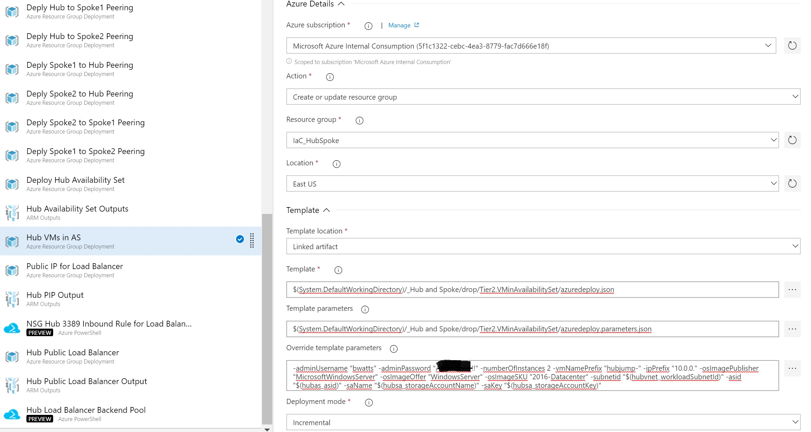

# Tier 2 Windows Virtual Machines in an Availability Set

This template deploys 1 to 5 Windows Virtual Machines along with Network Interfaces to an existing Availability Set. It also set up diagnostic logging to a Storage Account.

The deployment of this template is dependent on an existing Availability Set and Storage Account.

This template is typically deployed after and used the output from the following templates:  
<a href="https://security-monitoring.visualstudio.com/_git/IaC_HubSpokeNetwork?path=%2FTier%201%2FVNets%2FTier1.HubVNET%2FREADME.md&version=GBmaster">Hub VNet</a>  
<a href="https://security-monitoring.visualstudio.com/_git/IaC_HubSpokeNetwork?path=%2FTier%201%2FVNets%2FTier1.VNET%2FREADME.md&version=GBmaster">VNet</a>  
<a href="https://security-monitoring.visualstudio.com/_git/IaC_HubSpokeNetwork?path=%2FTier%201%2FStorage%20Accounts%2FTier1.StorrageAccount%2FREADME.md&version=GBmaster">Storage Account</a>  
<a href="https://security-monitoring.visualstudio.com/_git/IaC_HubSpokeNetwork?path=%2FTier%201%2FAvailabiity%20Set%2FTier1.AvailabilitySet%2FREADME.md&version=GBmaster">Availability Set</a>
 

This template is typically deployed before the following templates:  
	<a href="https://security-monitoring.visualstudio.com/_git/IaC_HubSpokeNetwork?path=%2FTier%202%2FLoad%20Balancers%2FPublic%20Load%20Balancer%2FPublic%20Load%20Balancer%2FREADME.md&version=GBmaster">Public Load Balancer</a>  
	<a href="https://security-monitoring.visualstudio.com/_git/IaC_HubSpokeNetwork?path=%2FScripts%2Freadme_lbAvailabilitySetBackEndPool.md&version=GBmaster">Script: Set Load Balancer Backend Pool</a>  
	<a href="https://security-monitoring.visualstudio.com/_git/IaC_HubSpokeNetwork?path=%2FScripts%2Freadme_lbNatRule.md&version=GBmaster">Script: Set Load NAT Rule</a>

## Required Inputs
In order to execute this template you must provide the following information.  

- adminUsername: Local admin username for the virtual machine
- adminPassword: Local admin password for the virtual machine
- numberOfInstances: Number of VMs to deploy in the availability set. Max number is set to 5.
- vmNamePrefix: Determines how each virtual machine name will start. Example is you deploy 3 instances and you give the prefix of examplevm then the names will be examplevm-1, examplevm-2, and examplevm-3
- osImageSKU: Determine the Windows OS to be deployed. Allowed values are 2012-R2-Datacenter or 2016-Datacenter
- subnetid: The resource id for the subnet that the virtual machine network interface will be placed on
- asid: The resource id for the Availability Set that the virtual machines will be placed in
- saName: The name of the storage account where the diagnostic and metrics will be stored
- saKey: The storage account key that will be used to access the storage account

## Outputs
This template currently does not output any values  

## Example Usage in Azure DevOps

1) Utilize the Azure Resource Group Deployment Task  

2) Choose the Azure subscription to deploy the task to

3) The "Action" should be "Create or update resource group"

4) Fill in the information for the "Resource group" and "Location"

5) Point to the template file located 

	$(System.DefaultWorkingDirectory)/_Hub and Spoke/drop/Tier2.VMinAvailabilitySet/azuredeploy.json

6) Point to the parameter file located

	$(System.DefaultWorkingDirectory)/_Hub and Spoke/drop/Tier2.VMinAvailabilitySet/azuredeploy.parameters.json

7) Override the Hub VNet properties with the appropriate values. Below is an example:  
	
	-adminUsername "bwatts" -adminPassword "************" -numberOfInstances 2 -vmNamePrefix "hubjump-" -ipPrefix "10.0.0." -osImagePublisher "MicrosoftWindowsServer" -osImageOffer "WindowsServer" -osImageSKU "2016-Datacenter" -subnetid "$(hubvnet_workloadSubnetId)" -asid "$(hubas_asid)" -saName "$(hubsa_storageAccountName)" -saKey "$(hubsa_storageAccountKey)" 

